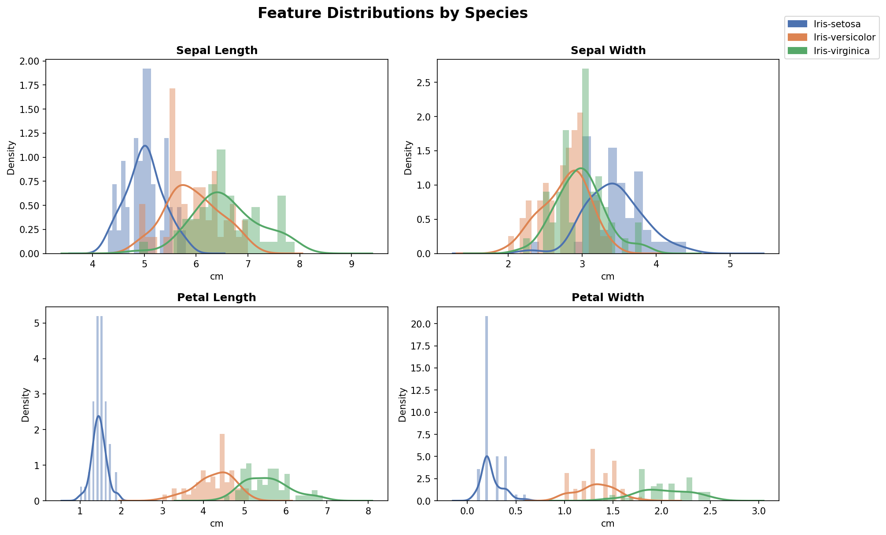
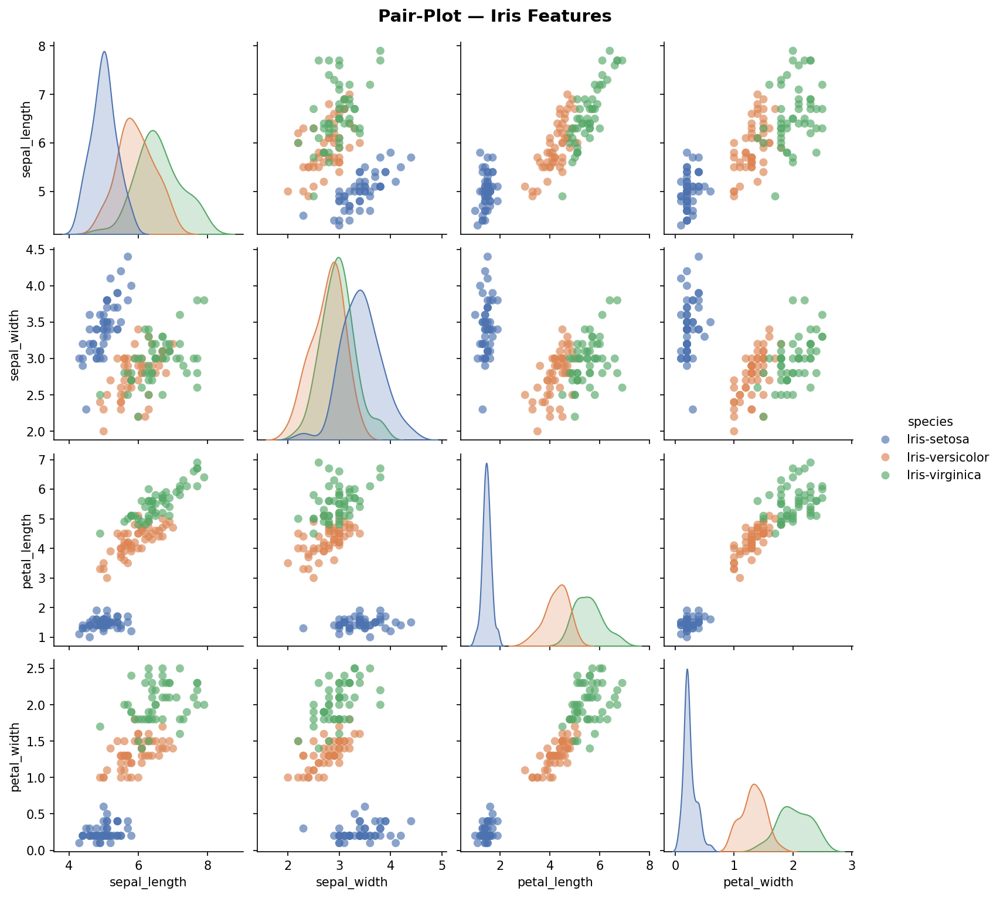
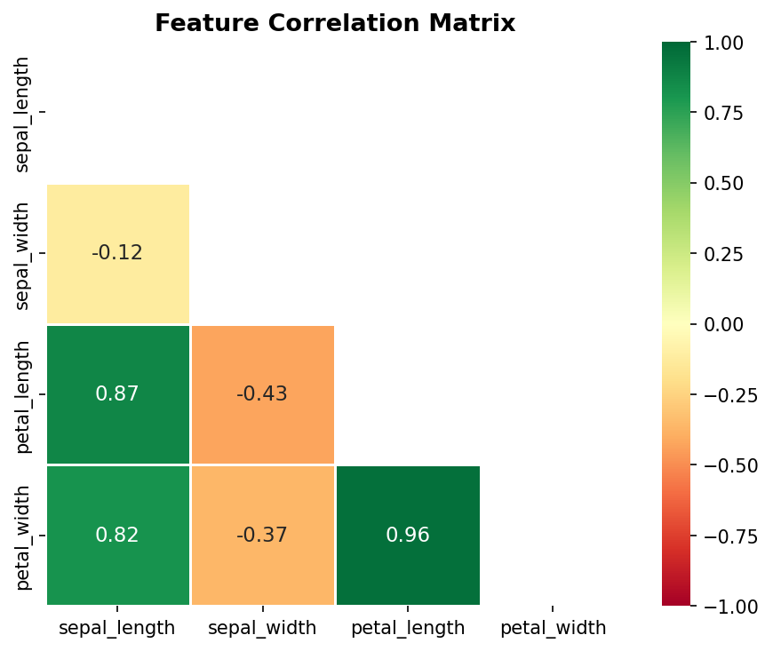
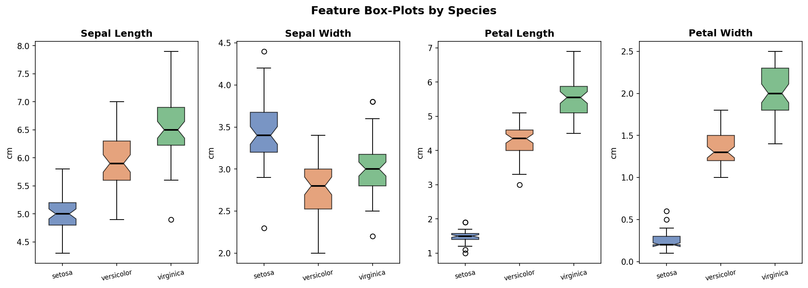
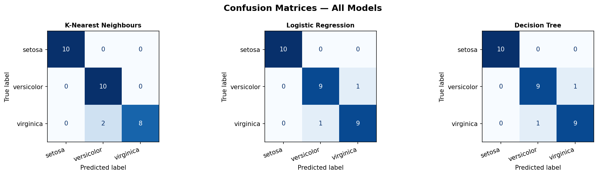
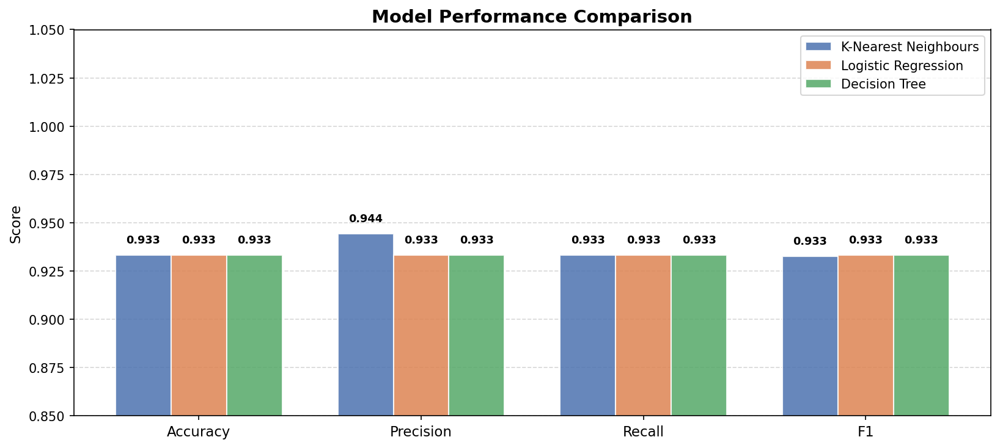
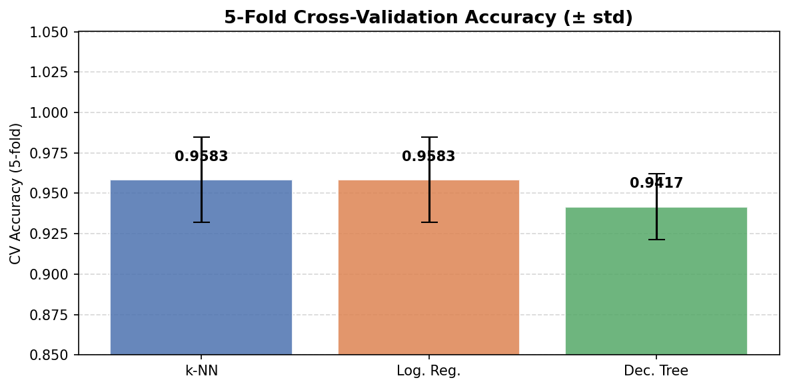
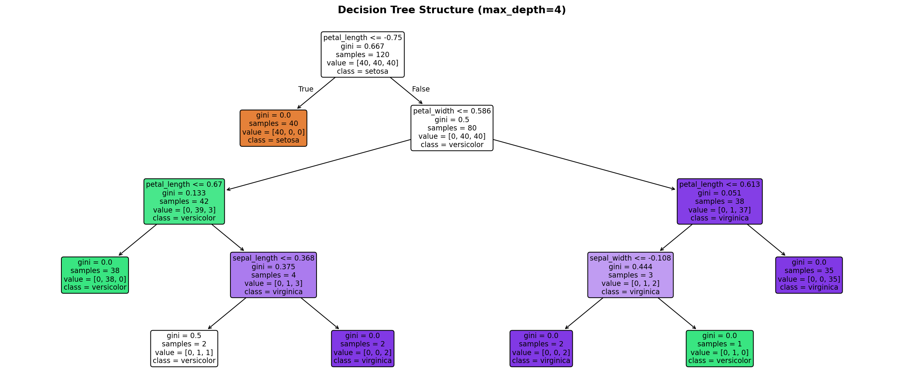

# 🌸 Iris Species Classification using Machine Learning


A complete machine learning classification project using the famous Iris Flower Dataset.

The objective is to classify iris flowers into three species:

- Iris-setosa
- Iris-versicolor
- Iris-virginica

using their sepal and petal measurements.

---

## 📌 Project Highlights

✔ Exploratory Data Analysis (EDA)

✔ Feature Correlation Analysis

✔ Model Training & Evaluation

✔ Cross-Validation

✔ Hyperparameter Selection

✔ Model Persistence (.pkl)

✔ Confusion Matrix Analysis

✔ Decision Tree Visualization

✔ Reproducible Notebook

---

## 📂 Repository Structure

```text
Iris-Classification/
│
├── IRIS.csv                    # Dataset
├── iris_classification.ipynb   # Complete notebook
├── iris_best_model.pkl         # Saved best model pipeline
├── README.md
│
├── fig1_distributions.png
├── fig2_pairplot.png
├── fig3_heatmap.png
├── fig4_boxplots.png
├── fig5_confusion.png
├── fig6_comparison.png
├── fig7_cv_scores.png
└── fig8_decision_tree.png
```

---

## 📊 Dataset Information

**Dataset:** Iris Flower Dataset

**Samples:** 150

**Features:** 4

| Feature | Unit |
|----------|------|
| Sepal Length | cm |
| Sepal Width | cm |
| Petal Length | cm |
| Petal Width | cm |

**Target Classes**

| Species | Samples |
|----------|----------|
| Iris-setosa | 50 |
| Iris-versicolor | 50 |
| Iris-virginica | 50 |

The dataset is balanced and contains no missing values.

---

## 🔍 Exploratory Data Analysis

### Feature Distributions



### Pair Plot



### Correlation Heatmap



### Boxplots



---

## 📈 Key Findings

### Feature Importance

- Petal Length and Petal Width are the most discriminative features.
- Sepal Width contributes the least to species separation.

### Correlation

| Feature Pair | Correlation |
|-------------|-------------|
| Petal Length ↔ Petal Width | 0.96 |
| Sepal Length ↔ Petal Length | 0.87 |
| Sepal Length ↔ Petal Width | 0.82 |

### Species Separation

- Iris-setosa is perfectly separable using petal measurements.
- Iris-versicolor and Iris-virginica show slight overlap.
- All model errors occur between Versicolor and Virginica.

---

## 🤖 Machine Learning Models

Three classification algorithms were trained using an 80/20 stratified train-test split.

### 1. K-Nearest Neighbours (k = 5)

- Distance-based classifier
- Best cross-validation performance

### 2. Logistic Regression

- Linear probabilistic classifier
- Strong baseline model

### 3. Decision Tree (max_depth = 4)

- Interpretable rule-based classifier
- Visualized decision boundaries

---

## 📊 Model Performance

### Test Set Results

| Model | Accuracy | Precision | Recall | F1 Score |
|---------|---------|---------|---------|---------|
| K-Nearest Neighbours | 93.3% | 94.4% | 93.3% | 93.3% |
| Logistic Regression | 93.3% | 93.3% | 93.3% | 93.3% |
| Decision Tree | 93.3% | 93.3% | 93.3% | 93.3% |

### Cross-Validation Results

| Model | Mean CV Accuracy |
|---------|---------|
| K-NN | 96.7% ± 2.7% |
| Logistic Regression | 95.8% ± 3.1% |
| Decision Tree | 94.2% ± 3.4% |

🏆 **Best Model: K-Nearest Neighbours**

Selected based on highest cross-validation accuracy and lowest variance.

---

## 📉 Confusion Matrices



Observations:

- Setosa classified perfectly.
- Minor confusion between Versicolor and Virginica.
- Maximum of 2 misclassifications.

---

## 📊 Metric Comparison



---

## 🔄 Cross Validation



K-NN achieved the most stable and highest-performing results across folds.

---

## 🌳 Decision Tree Visualization



Important splits are primarily based on:

- Petal Length
- Petal Width

showing their strong predictive power.

---

## 💾 Saved Model

The best-performing pipeline is stored as:

```text
iris_best_model.pkl
```

Pipeline Components:

```text
StandardScaler
        ↓
KNeighborsClassifier(k=5)
```

---

## 🚀 Quick Inference

### Install Requirements

```bash
pip install numpy pandas scikit-learn joblib matplotlib seaborn
```

### Load Model

```python
import joblib
import numpy as np

model = joblib.load("iris_best_model.pkl")

sample = np.array([[5.1, 3.5, 1.4, 0.2]])

prediction = model.predict(sample)

print(prediction[0])
```

Output:

```text
Iris-setosa
```

---

## ▶️ Run the Project

```bash
git clone https://github.com/USERNAME/Iris-Classification.git

cd Iris-Classification

pip install -r requirements.txt

jupyter notebook iris_classification.ipynb
```

Run all notebook cells to:

- Perform EDA
- Train models
- Evaluate performance
- Generate visualizations
- Save the best model

---

## 🎯 Conclusion

All three machine learning algorithms achieved 93.3% test accuracy.

Cross-validation revealed that K-Nearest Neighbours generalizes best, achieving:

96.7% ± 2.7%

The analysis also confirms that petal measurements alone contain most of the information required to accurately distinguish iris species.

---

## 👨‍💻 Author

**Adnan Rahman**

Sharda School of Computing Science and Engineering

Machine Learning Project — Iris Species Classification